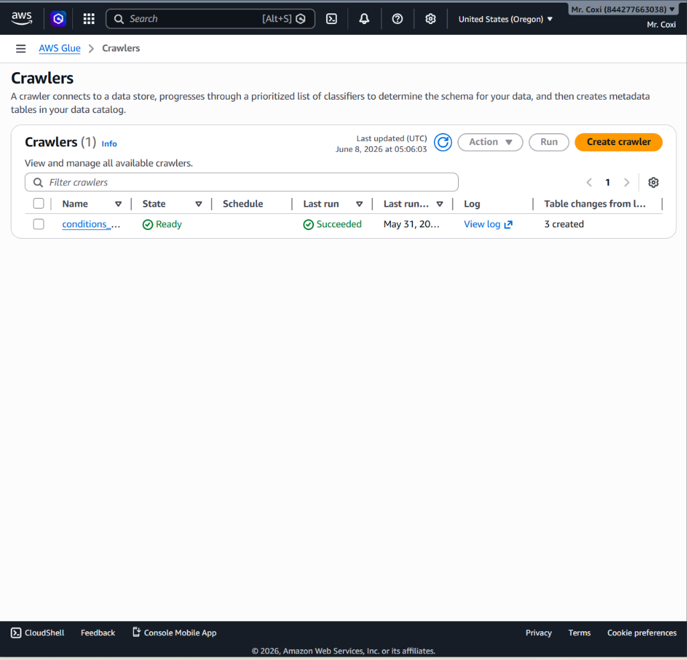

# 🏥 Healthcare Diabetes Analytics — End-to-End AWS Data Engineering Project


---

## 
Project Overview

A fully end-to-end cloud data engineering pipeline built on AWS that ingests raw synthetic healthcare data, applies clinical business logic to classify diabetes and prediabetes patients, enforces data quality standards across 10 automated checks, and delivers interactive analytics dashboards in Amazon QuickSight.

The pipeline follows a **medallion architecture** pattern — raw CSV files in S3 → schema discovery via Glue Crawler → SQL transformations in Athena → curated Parquet tables → dashboards. No running servers or clusters required; the entire pipeline is serverless.

**Key analytical question answered:**
> *Which patients in the dataset are diabetic or prediabetic — whether formally diagnosed or identified solely through their A1C lab values?*

---

## Architecture

```
┌─────────────────────────────────────────────────────────────────────┐
│                        DATA SOURCE                                  │
│         Synthea Synthetic EHR Data (Nov 2021 Sample)                │
│              patients.csv │ conditions.csv │ observations.csv       │
└─────────────────────────────┬───────────────────────────────────────┘
                              │ Upload
                              ▼
┌─────────────────────────────────────────────────────────────────────┐
│                     AMAZON S3 — RAW LAYER                           │
│         s3://healthcareproject-patient-data-2025/raw_data/          │
│         ├── patients/                                               │
│         ├── conditions/                                             │
│         └── observations/                                           │
└─────────────────────────────┬───────────────────────────────────────┘
                              │ Crawl
                              ▼
┌─────────────────────────────────────────────────────────────────────┐
│                   AWS GLUE CRAWLER + DATA CATALOG                   │
│         Database: healthcare_project_2026_raw_data                  │
│         IAM Role: AWSGlueServiceRole-HealthCareProject2025          │
│         Tables registered: patients, conditions, observations       │
└─────────────────────────────┬───────────────────────────────────────┘
                              │ Query + Transform
                              ▼
┌─────────────────────────────────────────────────────────────────────┐
│                       AMAZON ATHENA                                 │
│         View: patient_diabetes_summary                              │
│         (Clinical logic: condition flags + A1C thresholds)         │
└─────────────────────────────┬───────────────────────────────────────┘
                              │ CTAS → Parquet
                              ▼
┌─────────────────────────────────────────────────────────────────────┐
│                  AMAZON S3 — CURATED LAYER                          │
│         s3://healthcareproject-patient-data-2025/Curated/           │
│         ├── a1c_metrics/        ← Parquet                          │
│         ├── diabetes_registry/  ← Parquet                          │
│         └── patient_summary/    ← Parquet                          │
└──────────────┬─────────────────────────────────────────────────────┘
               │                              
               ▼                              
┌──────────────────────────┐    
│   AMAZON QUICKSIGHT      │    
│   (Live Athena Dataset)  │    
└──────────────────────────┘    
```

---

## Tech Stack

| Layer | Service / Tool | Purpose |
|---|---|---|
| Data Source | Synthea (Nov 2021 Sample) | Synthetic EHR dataset |
| Storage | Amazon S3 | Raw and curated data lake layers |
| IAM | AWS IAM | Glue Crawler permissions |
| Schema Discovery | AWS Glue Crawler | Auto-infer schemas, register tables |
| Data Catalog | AWS Glue Data Catalog | Central metadata store |
| Query Engine | Amazon Athena | SQL views, CTAS, quality checks |
| File Format | Parquet | Curated layer — columnar, compressed |
| Visualization | Amazon QuickSight | Cloud-native BI dashboard |
| Language | SQL (Trino/Presto) | All transformations and checks |

---

## Repository Structure

```
healthcare-diabetes-analytics/
│
├── README.md                                   ← You are here
│
├── sql/
│   ├── views/
│   │   └── patient_diabetes_summary.sql        ← Athena view (main logic)
│   │
│   ├── curated/
│   │   ├── a1c_metrics.sql                     ← Curated Table 1
│   │   ├── diabetes_registry.sql               ← Curated Table 2
│   │   └── patient_summary.sql                 ← Curated Table 3
│   │
│   └── quality_checks/
│       └── athena_quality_checks.sql           ← All 10 standalone checks
│
├── docs/
│   └── architecture.md                         ← Detailed architecture notes
│
└── screenshots/                                ← AWS console + dashboard screenshots
    ├── s3_bucket_structure.png
    ├── glue_crawler.png
    ├── glue_data_catalog.png
    ├── iam_role.png
    ├── athena_view.png
    ├── athena_curated_tables.png
    ├── quality_checks_results.png
    ├── quicksight_dashboard.png
    
```

---

## Dataset

**Source:** [Synthea](https://synthea.mitre.org/) — an open-source synthetic patient data generator widely used in healthcare data engineering projects.

**Version used:** `synthea_sample_data_csv_nov2021`

Three tables were used from the dataset:

| Table | Description | Key Columns |
|---|---|---|
| `patients` | Patient demographics | `id`, `birthdate`, `race`, `gender`, `city`, `state` |
| `conditions` | Diagnosed medical conditions | `patient`, `description`, `start` |
| `observations` | Lab results and vitals | `patient`, `description`, `value`, `date`, `units` |

> **Note:** The dataset is synthetic and contains no real patient data. It is safe for public sharing.

---

## Pipeline — Step by Step

### Step 1 — S3 Bucket Setup

Created S3 bucket `healthcareproject-patient-data-2025` in `us-west-2` (Oregon) with the following folder structure:

```
healthcareproject-patient-data-2025/
├── raw_data/
│   ├── patients/
│   ├── conditions/
│   └── observations/
└── Curated/
    ├── a1c_metrics/
    ├── diabetes_registry/
    ├── patient_summary/
    └── athena_results/
```

Raw CSV files were uploaded to their respective subfolders under `raw_data/`.

---

### Step 2 — AWS Glue Setup

**Database created:** `healthcare_project_2026_raw_data`
**S3 URI:** `s3://healthcareproject-patient-data-2025/raw_data/`

**IAM Role created:** `AWSGlueServiceRole-HealthCareProject2025`

Two IAM policies were attached:

- **Policy 1** — S3 read access scoped to the project bucket (`s3:GetObject`, `s3:ListBucket`, `s3:GetBucketLocation`)
- **Policy 2** — Standard Glue service permissions including Glue full access, S3 bucket management, EC2 networking, IAM role lookup, and CloudWatch logging

**Glue Crawler** was configured to crawl `s3://healthcareproject-patient-data-2025/raw_data/` using the IAM role above. After running, three tables were registered in the Glue Data Catalog:
- `patients`
- `conditions`
- `observations`

---

### Step 3 — Athena View

An Athena SQL view `patient_diabetes_summary` was created, joining all three raw tables. The view applies clinical logic to classify each patient:

**Classification rules:**
| Status | Condition |
|---|---|
| Diabetes | Diagnosed condition matching `%diabet%` (excluding prediab) |
| Diabetes | Latest A1C ≥ 6.5% (ADA clinical threshold) |
| Prediabetes | Diagnosed condition matching `%prediab%` |
| Prediabetes | Latest A1C between 5.7% and 6.4% (ADA clinical threshold) |

**Key SQL techniques used:**
- `MAX_BY(value, date)` — retrieves the most recent A1C reading per patient
- `from_iso8601_timestamp()` — parses ISO date strings for correct ordering
- `LOWER() + LIKE` — case-insensitive condition matching
- `MIN()` on condition start dates — finds earliest diagnosis date
- `COALESCE()` — handles patients with no condition records
- `CASE` with generational birth year ranges — Baby Boomers through Gen Alpha
- Race normalization — Hawaiian → Polynesian

See full SQL: [`sql/views/patient_diabetes_summary.sql`](healthcare-diabetes-analytics/sql/views/patient_diabetes_summary.sql)

---

### Step 4 — Curated Parquet Tables

Three curated tables were created using Athena `CREATE TABLE AS SELECT` (CTAS), writing Parquet files to the S3 curated layer.

**Why Parquet over CSV?**
- Columnar format — Athena only scans columns needed, reducing cost
- Compressed — significantly smaller than CSV
- Typed — data types preserved without inference
- Industry standard for analytical data lake layers

**Run order matters — dependencies:**
```
a1c_metrics       ← run first  (no dependencies)
diabetes_registry ← run second (no dependencies)
patient_summary   ← run third  (depends on both above)
```

#### Table 1: `a1c_metrics`
Aggregated A1C lab history per patient from the `observations` table.

| Column | Description |
|---|---|
| `patient_id` | Unique patient identifier |
| `latest_a1c` | Most recent A1C reading |
| `first_a1c` | Earliest A1C reading |
| `average_a1c` | Mean across all readings |
| `max_a1c` | Highest A1C ever recorded |
| `min_a1c` | Lowest A1C ever recorded |
| `total_readings` | Count of all A1C readings |
| `latest_a1c_category` | Diabetic / Prediabetic / Normal Range |

See full SQL: [`sql/curated/a1c_metrics.sql`](healthcare-diabetes-analytics/sql/curated/a1c_metrics.sql)

#### Table 2: `diabetes_registry`
Patient demographics enriched with diagnosis flags from the `conditions` table.

| Column | Description |
|---|---|
| `patient_id` | Unique patient identifier |
| `age` | Current age calculated from birthdate |
| `generation` | Baby Boomers / Gen X / Millennials / Gen Z / Gen Alpha |
| `race` | Normalized race value |
| `diagnosis_date` | Earliest diabetes-related condition date |
| `diabetes_flag` | 1 if diabetes condition exists |
| `prediabetes_flag` | 1 if prediabetes condition exists |

See full SQL: [`sql/curated/diabetes_registry.sql`](healthcare-diabetes-analytics/sql/curated/diabetes_registry.sql)

#### Table 3: `patient_summary`
Master analytics table joining `diabetes_registry` and `a1c_metrics`. Primary table used for dashboards.

| Column | Description |
|---|---|
| `patient_id` | Unique patient identifier |
| `diabetes_status` | Resolved status: Diabetes or Prediabetes |
| `latest_a1c` | Most recent A1C value |
| `latest_a1c_category` | A1C risk category |
| `generation` | Generational cohort |
| `diagnosis_date` | Earliest diagnosis date |

See full SQL: [`sql/curated/patient_summary.sql`](healthcare-diabetes-analytics/sql/curated/patient_summary.sql)

---

### Step 5 — Data Quality Checks

10 automated data quality checks were implemented in two ways:

**1. Standalone validation queries** — run in Athena to inspect bad records before and after table creation.

**2. Embedded quality columns** — each curated table contains dedicated `check_N_*` columns labeling every row as `PASS` or `FAIL` with a descriptive reason. This enables dashboard-level quality reporting without deleting flagged records.

| Check | Table | Rule | Result |
|---|---|---|---|
| 1 | a1c_metrics | A1C between 3.0 and 20.0% | 15 FAIL (synthetic data artifacts) |
| 2 | a1c_metrics | Patient ID not null | All PASS |
| 3 | a1c_metrics | Total readings > 0 | All PASS |
| 4 | diabetes_registry | Patient ID not null | All PASS |
| 5 | diabetes_registry | Birthdate not in future | All PASS |
| 6 | diabetes_registry | Flags are 0 or 1 only | All PASS |
| 7 | diabetes_registry | Age between 0 and 120 | All PASS |
| 8 | patient_summary | Status is Diabetes or Prediabetes | All PASS |
| 9 | patient_summary | A1C value matches category | All PASS |
| 10 | patient_summary | No missing A1C data | All PASS |

> **Check 1 finding:** 15 patients had A1C values below 3.0% — clinically impossible in a living patient. These are artifacts of Synthea's data generation algorithm. Records are flagged as `FAIL` and retained (not deleted) following production pipeline best practices.

See full SQL: [`sql/quality_checks/athena_quality_checks.sql`](healthcare-diabetes-analytics/sql/quality_checks/athena_quality_checks.sql)

---

### Step 6 — Dashboards

#### Amazon QuickSight
Connected directly to Athena via the Glue Data Catalog. SPICE caching enabled for fast rendering.

**Visuals built:**
- KPI cards — Total Patients, Diabetes Count, Prediabetes Count, Average A1C
- Donut chart — Diagnosis distribution (Diabetes vs Prediabetes)
- Bar chart — Patients by generation

---

## Notable SQL Patterns

**Retrieve most recent value per patient using MAX_BY:**
```sql
MAX_BY(
    CAST(value AS DOUBLE),
    from_iso8601_timestamp(date)
) AS latest_a1c
```

**Generational classification from birthdate:**
```sql
CASE
    WHEN year(CAST(birthdate AS DATE)) BETWEEN 1946 AND 1964 THEN 'Baby Boomers'
    WHEN year(CAST(birthdate AS DATE)) BETWEEN 1965 AND 1980 THEN 'Generation X'
    WHEN year(CAST(birthdate AS DATE)) BETWEEN 1981 AND 1996 THEN 'Millennials (Gen Y)'
    WHEN year(CAST(birthdate AS DATE)) BETWEEN 1997 AND 2012 THEN 'Generation Z'
    WHEN year(CAST(birthdate AS DATE)) >= 2013              THEN 'Generation Alpha'
    ELSE 'Other'
END AS generation
```

**Clinical diabetes classification combining condition flags and A1C:**
```sql
CASE
    WHEN diabetes_flag = 1                  THEN 'Diabetes'
    WHEN latest_a1c >= 6.5                  THEN 'Diabetes'
    WHEN prediabetes_flag = 1               THEN 'Prediabetes'
    WHEN latest_a1c BETWEEN 5.7 AND 6.4     THEN 'Prediabetes'
END AS diabetes_status
```

**Embedded data quality check:**
```sql
CASE
    WHEN MIN(a1c_value) < 3.0 OR MAX(a1c_value) > 20.0
        THEN 'FAIL - A1C outside clinical range (3.0-20.0)'
    ELSE 'PASS'
END AS check_1_a1c_clinical_range
```

---

## Screenshots

> Add your screenshots to the `screenshots/` folder and they will display here.

| Screenshot | Description |
|---|---|
|  | S3 bucket showing raw and curated folder layout |
|  | Glue Crawler configuration and run status |
|  | Glue Data Catalog showing registered tables |
|  | IAM role and attached policies |
|  | Athena view query and sample results |
|  | Three curated tables visible in Athena |
|  | Quality check summary query results |
|  | QuickSight dashboard |

---

## What This Project Demonstrates

- **AWS End-to-End Pipeline** — S3 → Glue → Athena → QuickSight, fully serverless
- **Medallion Architecture** — clear separation of raw CSV and curated Parquet layers
- **Advanced SQL** — CTEs, `MAX_BY`, `MIN_BY`, `date_diff`, `from_iso8601_timestamp`, CTAS
- **Data Quality Engineering** — 10 embedded checks across 3 tables with PASS/FAIL labeling
- **Healthcare Domain Knowledge** — ADA clinical A1C thresholds, EHR data modeling
- **IAM Security** — least-privilege role scoped to project bucket
- **Data Visualization** — QuickSight dashboards
- **Production Mindset** — flagging bad data rather than silently dropping it

---

## Author

**Herlesio Coxi**
Data Engineer | GCP · AWS · Python · SQL · ETL Pipelines

🔗 [LinkedIn](https://www.linkedin.com/in/herlesio-coxi/)

