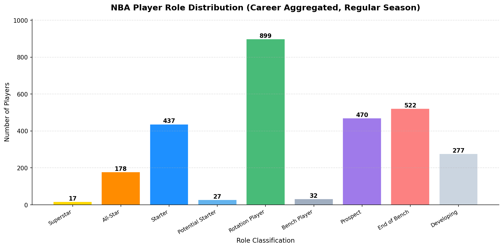
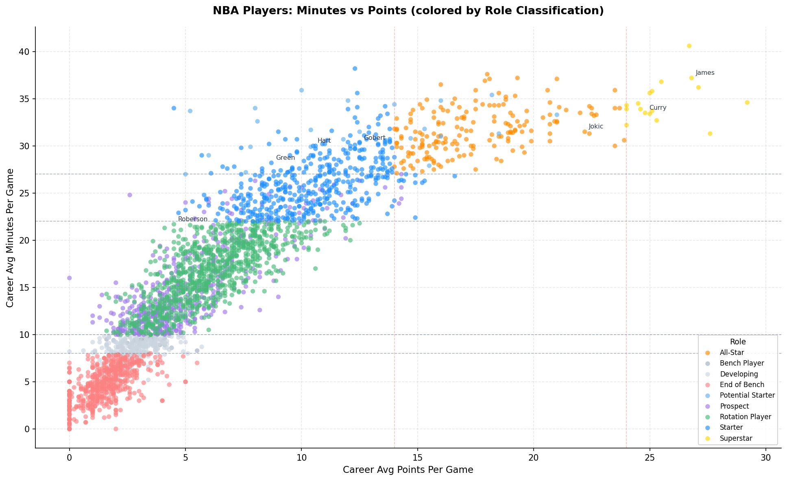
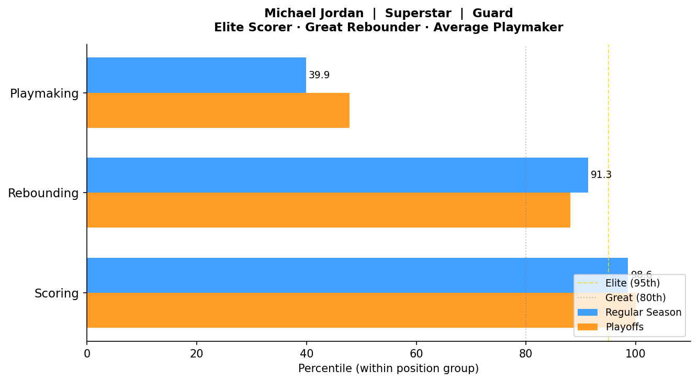

# 🏀 NBA Player Archetype Classification System


**Author:** Herlesio
**Stack:** Python · Pandas · NumPy · Databricks · Delta Lake · Matplotlib
**Data:** NBA box score data (1996–present)

---

## Project Overview

A data engineering pipeline that classifies every NBA player by **role** and **skill profile** using career-aggregated Regular Season and Playoff box score data.

Minutes are the primary driver of role classification — they reflect how much a coaching staff trusts and relies on a player. Points are secondary, used only to separate Superstar from All-Star at the top tier. This intentionally accounts for high-impact, low-scoring players like **Draymond Green** (Starter) and **Andre Roberson** (Rotation Player) without penalizing them for not scoring.

---

## Architecture

```
PlayerStatisticsExtended.csv, Players.csv
      │
      ▼
  Upload via Catalog → Add Data → Upload files to DBFS
      │
      ▼
  Databricks Free Edition (Serverless)
  │
  ├── Source Tables (Delta)
  │     ├── players_categorization.reclassification.player_statistics_extended
  │     └── players_categorization.reclassification.players
  │
  ├── Pandas Transformation
  │     ├── Canonical name resolution + duplicate game removal
  │     ├── Position mapping (Center > Forward > Guard priority)
  │     ├── Role classification (minutes-first, 9 tiers)
  │     ├── Per-36 skill metrics (Scoring / Rebounding / Playmaking)
  │     └── Independent percentile pools — Regular Season vs Playoffs
  │
  ├── Output Table (Delta)
  │     └── players_categorization.reclassification.player_archetype_system
  │
  └── Matplotlib → 3 charts, exported as PNG via base64 download buttons
```

---

## Dataset

| File | Description |
|---|---|
| `PlayerStatisticsExtended.csv` | One row per player per game — minutes, points, rebounds, assists, game type |
| `Players.csv` | One row per player — position flags (guard/forward/center) |

Both files joined on `personId`. Filtered to `Regular Season` and `Playoffs` game types only.

---

## Pipeline Steps

**1. Ingest** — Upload both CSVs to DBFS, load into Delta tables (`player_statistics_extended`, `players`) via `spark.read.csv()`. One-time step.

**2. Prep & Filter** — Resolve a canonical name per `personId` (most frequent name wins, handles typos/changes), remove duplicate player-game records, filter to Regular Season and Playoffs.

**3. Aggregate** — Career totals per player per season type: games played, total/avg minutes, avg points/rebounds/assists.

**4. Position Mapping** — Center > Forward > Guard priority for multi-position players.

**5. Role Classification** — Minutes-first, 9-tier system (see below). Derived from Regular Season only, then stamped onto the corresponding Playoffs row.

**6. Per-36 Metrics** — Points, rebounds, and assists normalized to a 36-minute baseline.

**7. Percentile Pools** — Computed **independently** for Regular Season and Playoffs, and **within position group** (Guard / Forward / Center).

**8. Skill Labels** — Percentile → Elite / Great / Good / Average / Limited, per skill, per season type.

**9. Persist** — Clean column names for Delta compatibility (snake_case), save as `players_categorization.reclassification.player_archetype_system`.

**10. Visualize** — Three Matplotlib charts with one-click PNG download buttons.

---

## Classification System

### Role Tiers

| Tier | Avg Minutes | Avg Points | Career Games | Notes |
|------|------------|------------|--------------|-------|
| Superstar | 27+ | 24+ | 150+ | Franchise cornerstone |
| All-Star | 27+ | 14–24 | 150+ | Primary option, consistent star |
| Starter | 22+ | — | 150+ | Minutes-first; no points floor |
| Rotation Player | 10–22 | — | 100+ | Trusted contributor |
| Bench Player | 8–10 | — | 100+ | Limited but consistent role |
| End of Bench | <8 | — | <50 | Fringe roster spot |
| Potential Starter | 27+ | — | <150 | Starter usage, career interrupted |
| Prospect | 10–27 | — | <100 | On trajectory, small sample |
| Developing | ≤10 | — | <150 | Establishing themselves |

> **Why minutes over points?** Josh Hart averages ~10 points but plays 30 minutes — his coach trusts him in critical moments. Draymond Green averages ~8 points but is a cornerstone starter. Points tell you the *style* of impact, not the *magnitude* of it.

### Skill Labels

Per-36 metrics (Pts/Reb/Ast per 36 minutes) ranked within each position group:

| Percentile | Label |
|-----------|-------|
| ≥ 95th | Elite |
| ≥ 80th | Great |
| ≥ 60th | Good |
| ≥ 30th | Average |
| < 30th | Limited |

**Minimum eligibility for percentile pool:**
- Regular Season: 500+ total minutes, 40+ games
- Playoffs: 100+ total minutes, 10+ games

---

## What This Data Helps You Understand

**Player Role & Team Importance** — *"How important was this player to his team?"* Minutes-first classification correctly places defenders and playmakers without penalizing them for not scoring.

**Skill Profile by Position** — *"What does this player do well, compared to others at his position?"* Percentiles computed within position groups so centers aren't compared to guards on rebounding, or guards to centers on assists.

**Playoff Performance vs Regular Season** — Because percentiles are computed independently for each context:
- **Who elevates?** A player jumping from Good Scorer (RS) to Elite Scorer (Playoffs) is a proven big-game performer.
- **Who shrinks?** A drop from Great Playmaker to Average Playmaker under playoff pressure is exposed.
- **Who is consistent?** Superstars like LeBron James and Nikola Jokic show nearly identical percentiles across both — the mark of elite stability.

**Developmental Trajectory** — The Potential Starter → Prospect → Developing ladder identifies young players on a starter path before they've accumulated enough career games, and players whose careers were interrupted by injury.

**Roster Construction** — Viewed across a full team, the classification breakdown reveals whether a team is top-heavy, whether the bench has legitimate Rotation Players or mostly Developing/End of Bench players, and how playoff rosters compare to regular season rosters.

---

## Visualizations

### Role Distribution — Regular Season


### Minutes vs Points (colored by Role Classification)
Dashed reference lines mark the classification boundaries — shows the minutes-first philosophy visually across the full player population.



### Player Skill Profile
Change the `PLAYER_NAME` variable in the notebook to generate this chart for any player — Regular Season vs Playoffs percentiles side by side.



**Also available (table-based, no chart):** Playoff Elevators and Shrinkers — ranks every player by how much their scoring percentile changed between Regular Season and Playoffs. Rendered as an interactive `display()` table in the notebook rather than a static chart.

---

## Output Schema

| Column (pandas) | Column (Delta table) | Description |
|--------|--------|-------------|
| `personId` | `person_id` | Unique player identifier |
| `playerName` | `player_name` | Canonical full name |
| `Position` | `position` | Guard / Forward / Center |
| `Season Type` | `season_type` | Regular Season or Playoffs |
| `Games Played` | `games_played` | Unique games (career total) |
| `Total Minutes` | `total_minutes` | Career total minutes |
| `Avg Points` | `avg_points` | Career points per game |
| `Avg Rebounds` | `avg_rebounds` | Career rebounds per game |
| `Avg Assists` | `avg_assists` | Career assists per game |
| `Avg Minutes` | `avg_minutes` | Career minutes per game |
| `Pts Per 36` | `pts_per_36` | Points per 36 minutes |
| `Reb Per 36` | `reb_per_36` | Rebounds per 36 minutes |
| `Ast Per 36` | `ast_per_36` | Assists per 36 minutes |
| `Scoring Percentile` | `scoring_percentile` | Rank vs position peers (0–100) |
| `Rebounding Percentile` | `rebounding_percentile` | Rank vs position peers (0–100) |
| `Playmaking Percentile` | `playmaking_percentile` | Rank vs position peers (0–100) |
| `Role Classification` | `role_classification` | Tier label (see above) |
| `Scoring Label` | `scoring_label` | Elite / Great / Good / Average / Limited Scorer |
| `Rebounding Label` | `rebounding_label` | Elite / Great / Good / Average / Limited Rebounder |
| `Playmaking Label` | `playmaking_label` | Elite / Great / Good / Average / Limited Playmaker |

> **Why two column name sets?** The Python script renames columns to snake_case before saving to Delta (Delta tables reject spaces and special characters). Use the **pandas** names in notebook cells working with the `agg` DataFrame, and the **Delta** names in SQL queries against `players_categorization.reclassification.player_archetype_system`.

---

## Repository Structure

```
nba-player-archetype-system/
├── player_archetype_system.py              # Standalone script (local CSV paths)
├── NBA_Player_Archetype_System.ipynb       # Databricks notebook (full pipeline + charts)
├── README.md
├── sql/
│   ├── create_tables.sql                   # Catalog/schema setup
│   └── analysis_queries.sql                # 6 analysis queries
├── data/
│   └── player_archetype_system_sample.csv  # 500-row output sample
└── charts/
    ├── role_distribution.png
    ├── minutes_vs_points_scatter.png
    └── player_skill_profile.png
```

---

## How to Run

**In Databricks Free Edition:**

1. Upload `PlayerStatisticsExtended.csv` and `Players.csv` via **Catalog → Add Data → Upload files to DBFS**
2. Create catalog `players_categorization` and schema `reclassification` (or run `sql/create_tables.sql`)
3. Import `NBA_Player_Archetype_System.ipynb` into your Workspace
4. Run all cells top to bottom — the Delta table and charts are generated automatically
5. Use the **Download chart** button below each chart to save the PNGs
6. Open the SQL Editor and run the queries in `sql/analysis_queries.sql` against the output table

**Locally:**

```bash
pip install pandas numpy matplotlib
python player_archetype_system.py
```

Update the three path constants at the top of the script:
```python
STATS_PATH   = "path/to/PlayerStatisticsExtended.csv"
PLAYERS_PATH = "path/to/Players.csv"
OUTPUT_PATH  = "path/to/player_archetype_system.csv"
```

> Note: the local script outputs a CSV. Chart generation and the Delta table save are Databricks-notebook-only steps — see the notebook for the full visualization pipeline.

---

## Key Design Decisions

**Why career aggregation instead of per-season?**
Career aggregation provides a stable, noise-resistant view of what a player *is*. Per-season classification would be more granular but requires handling season-by-season game thresholds differently and is more sensitive to injury-shortened seasons. A per-season version is a natural next iteration of this system.

**Why independent Playoff percentile pools?**
Playoff competition is self-selecting — only the best teams and players make it. A player ranked in the 60th percentile of Playoff performers is competing against a much stronger pool than the full Regular Season population. Mixing them would understate how hard it is to perform in the playoffs.

**Why position-based percentiles?**
A center rebounding at the 80th percentile among centers is a fundamentally different statement than a guard rebounding at the 80th percentile among guards. Position-based pools make the labels meaningful and comparable across eras.

**Why minutes-first role classification?**
Points alone misclassify high-impact, low-scoring players. A coach's decision to play someone 30 minutes a night is a stronger signal of trust and importance than their scoring average — this is what separates Draymond Green (Starter) from a bench scorer averaging the same points in 15 minutes.

---

## Future Enhancements

- **Per-season classification** — replace career aggregation with season-by-season role assignment for higher precision
- **Player card layout** — one visual card per player combining role badge, skill labels, and percentile bars
- **Radar/spider chart** — three-axis (Scoring/Rebounding/Playmaking) visual archetype per player
- **RS vs Playoffs delta table as a chart** — visualize the elevators/shrinkers ranking instead of a plain table

---

## What This Project Demonstrates

- Career-aggregated data classification with minutes-first business logic
- Position-normalized percentile ranking (avoiding cross-position bias)
- Independent statistical pools for different competitive contexts (RS vs Playoffs)
- PySpark ↔ Pandas interoperability in Databricks notebooks
- Delta Lake table creation with Delta-compatible column naming
- Data visualization with Matplotlib, including in-notebook chart export
- Local/cloud execution parity (standalone script vs Databricks notebook)

---

## Author

**Herlesio**
Data Engineer · [LinkedIn](https://www.linkedin.com/in/herlesio-coxi/)
