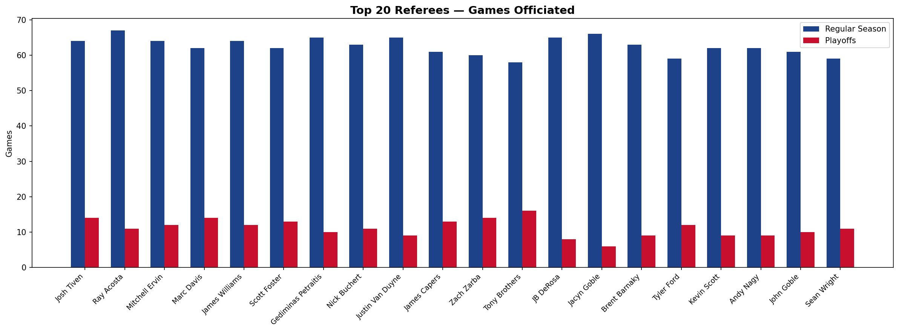
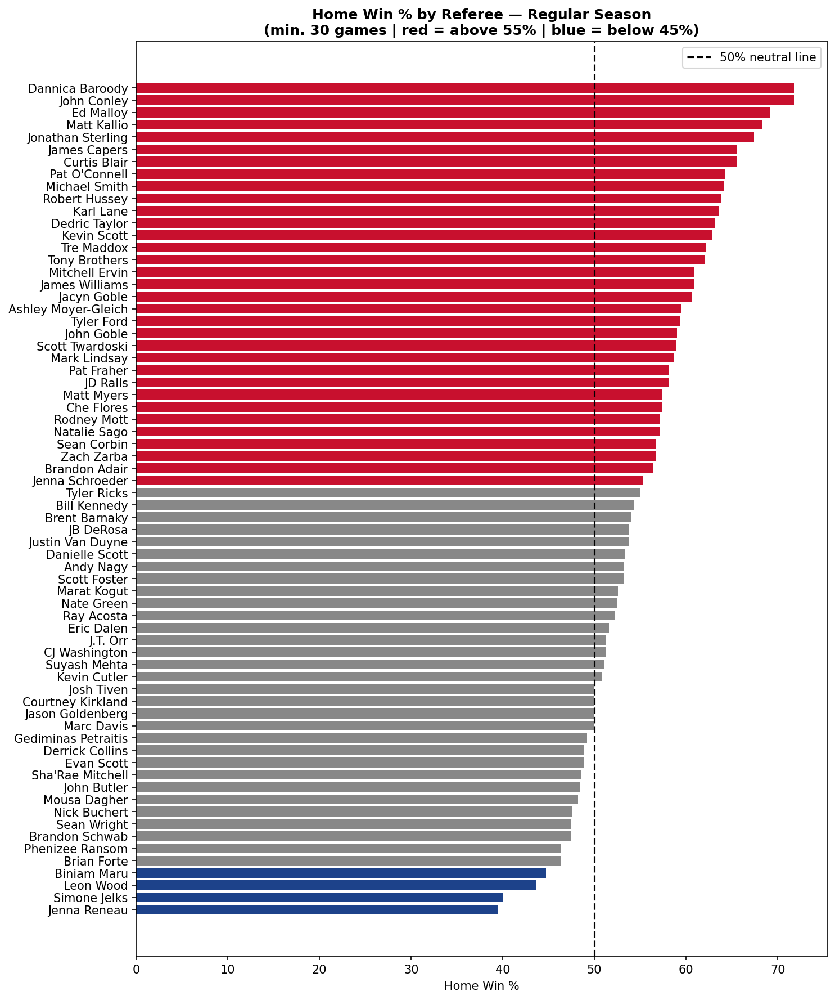
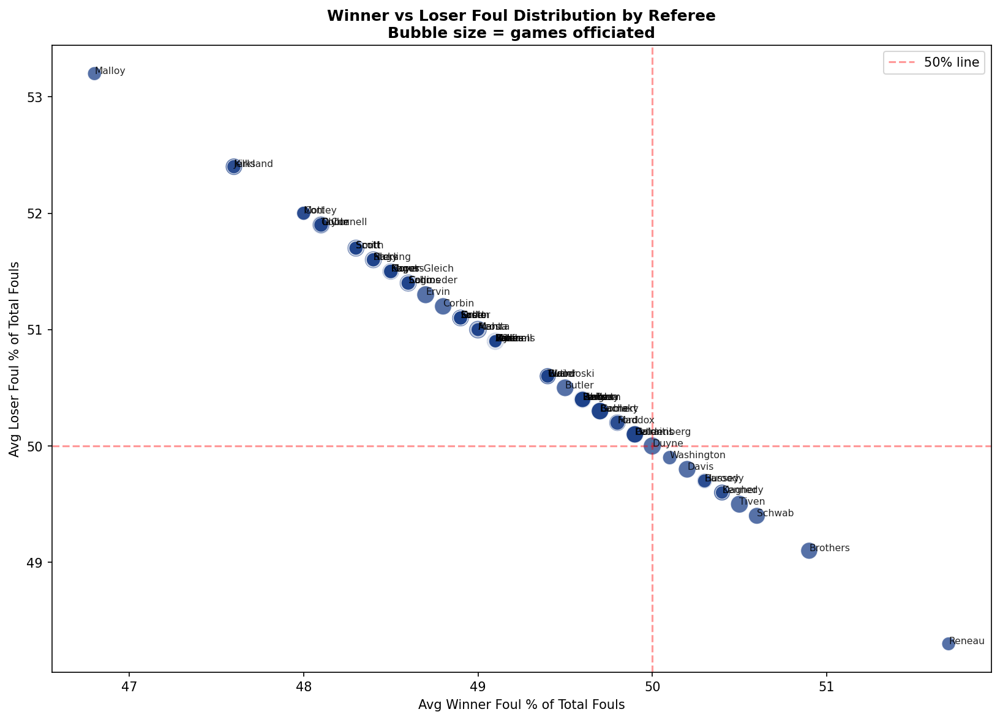

# NBA Referee Analysis — Data Engineering Pipeline


**Author:** Herlesio
**Stack:** Python · Pandas · Databricks · Delta Lake · Matplotlib
**Data:** [Kaggle — NBA Games & Team Statistics Dataset](https://www.kaggle.com)

---

## Project Overview

This project builds an end-to-end data engineering pipeline that ingests raw NBA game and team statistics data, transforms it using Python and PySpark, persists results as a Delta Lake table in Databricks, and surfaces insights through visualizations about NBA referee tendencies.

The analysis answers three questions:

- How many games did each referee officiate, split by Regular Season and Playoffs?
- What percentage of games did the home team win under each referee?
- How were fouls distributed between winning and losing teams under each referee?

---

## Architecture

```
Kaggle CSV Files (Games.csv, TeamStatisticsExtended.csv)
      │
      ▼
  Upload via Catalog → Add Data → Upload files to DBFS
      │
      ▼
  Databricks Free Edition (Serverless)
  │
  ├── Step 1: spark.read.csv() → Delta Tables (one-time ingestion)
  │     ├── nba_referee_analysis.referee_analysis.games
  │     └── nba_referee_analysis.referee_analysis.team_statistics_extended
  │
  ├── Step 2: spark.table().toPandas() → Pandas transformation
  │     ├── Season type mapping
  │     ├── Per-game foul + result table
  │     ├── Officials explode (one row per game-referee)
  │     ├── Aggregate by referee × season type
  │     └── Pivot — Regular Season & Playoffs side by side
  │
  ├── Step 3: Persist
  │     └── nba_referee_analysis.referee_analysis.referee_summary (Delta table)
  │
  └── Step 4: Matplotlib → 3 charts, exported as PNG via base64 download buttons
```

---

## Dataset

| File | Description |
|---|---|
| `Games.csv` | One row per game — teams, scores, game type, officials |
| `TeamStatisticsExtended.csv` | Two rows per game (one per team) — personal fouls, win/home flags |

Both files sourced from Kaggle. Games are joined on `gameId`. The `officials`
column (referee names, comma-separated) lives in `Games.csv` and is exploded
so each referee gets one row per game they worked.

**Game types included:**

| Source Label | Mapped To |
|---|---|
| Regular Season | Regular Season |
| Emirates NBA Cup / NBA Cup | Regular Season |
| Playoffs | Playoffs |
| Play-in Tournament | Playoffs |

---

## Pipeline Steps

**1. Ingest** — Upload `Games.csv` and `TeamStatisticsExtended.csv` to DBFS via the Catalog UI, then load into Delta tables (`games`, `team_statistics_extended`) using `spark.read.csv()`. This is a one-time step — re-run only if source data changes.

**2. Read** — Load both Delta tables into Pandas using `spark.table().toPandas()` for transformation.

**3. Transform** — Map game types, build a per-game foul table by joining winning/losing team rows, then explode the `officials` column so each referee gets one row per game they worked.

**4. Aggregate** — Group by referee and season type, computing game counts, home/away win percentages, and average foul distributions per game.

**5. Pivot** — Reshape so Regular Season and Playoffs metrics sit side by side in one row per referee.

**6. Persist** — Clean column names for Delta compatibility, convert to Spark, and save as a Delta table: `nba_referee_analysis.referee_analysis.referee_summary`.

**7. Visualize** — Generate three charts using Matplotlib, each with a one-click download button (base64-encoded PNG via `displayHTML`).

---

## Key Metrics (per referee, per season type)

| Column | Description |
|---|---|
| Games Officiated | Total games worked in that season type |
| Home Win % | % of their games the home team won |
| Away Win % | % of their games the away team won |
| Avg Winner Fouls | Avg personal fouls committed by the winning team |
| Avg Loser Fouls | Avg personal fouls committed by the losing team |
| Avg Total Fouls/Game | Combined foul average per game |
| Winner Foul % of Total | Winner's fouls as % of all fouls called that game (avg) |
| Loser Foul % of Total | Loser's fouls as % of all fouls called that game (avg) |

> **Note:** `foulsPersonal` reflects fouls **committed by** each team, not drawn. A winner foul % below 50% means the winning team tended to commit fewer fouls than the losing team.

---

## Visualizations

### Games Officiated — Top 20 Referees


### Home Win % by Referee — Regular Season
Red = above 55% (home-favoring) | Blue = below 45% (away-favoring) | Minimum 30 games officiated



### Winner vs Loser Foul Distribution
Bubble size = games officiated | Minimum 20 games officiated
Referees near the center (50/50) call fouls evenly between winners and losers.



---

## Repository Structure

```
nba-referee-analysis/
├── NBA_Referee_Analysis.ipynb    # Databricks notebook (full pipeline + charts)
├── referee_analysis.py           # Standalone Python script (runs locally with CSVs)
├── README.md
└── charts/
    ├── games_officiated.png
    ├── home_win_pct.png
    └── foul_scatter.png
```

---

## How to Run

**In Databricks Free Edition:**

1. Upload `Games.csv` and `TeamStatisticsExtended.csv` via **Catalog → Add Data → Upload files to DBFS**
2. Import `NBA_Referee_Analysis.ipynb` into your Workspace
3. Run **Cell 1** once to load the CSVs into Delta tables
4. Run all remaining cells top to bottom — the Delta table and charts are generated automatically
5. Use the **⬇ Download chart** button below each chart to save the PNGs, then add them to your `charts/` folder

**Locally:**

```bash
pip install pandas matplotlib
python referee_analysis.py
```

Update the file paths at the top of `referee_analysis.py` to point to your local CSV files. Charts and the output CSV save automatically to a local `charts/` folder.

---

## What This Project Demonstrates

- Cloud-native ingestion: raw CSV → Delta Lake table via Databricks Catalog
- PySpark DataFrame operations and schema inference
- Pandas transformation pipelines (explode, groupby, pivot)
- Delta Lake table creation and catalog/schema management
- Statistical reliability thresholds (minimum sample sizes per chart)
- Data visualization with Matplotlib, including in-notebook chart export
- End-to-end notebook documentation for reproducibility
- Parity between cloud (Databricks) and local (standalone script) execution paths

---

## Author

**Herlesio**
Data Engineer · [LinkedIn](https://www.linkedin.com/in/herlesio-coxi/)
